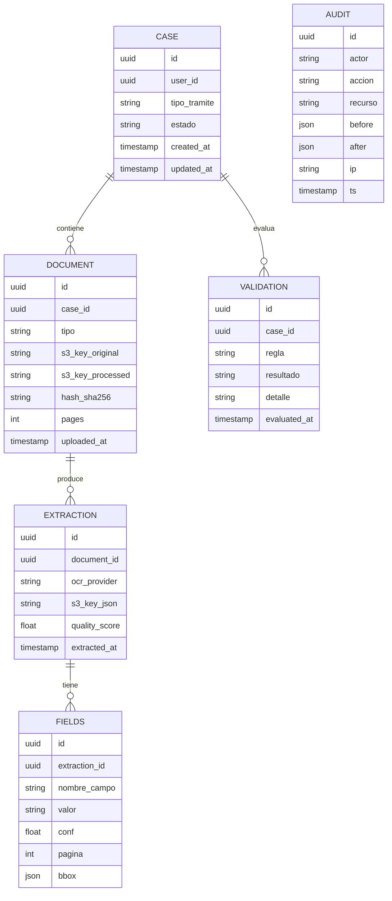

# 3) Modelo de Datos - ER Mínimo Viable

Modelo entidad-relación para el sistema de visación de residencia.

> **Nota**: Auditoría de alta frecuencia puede ir en DynamoDB (append-only) con TTL y export a S3 para archivado. 