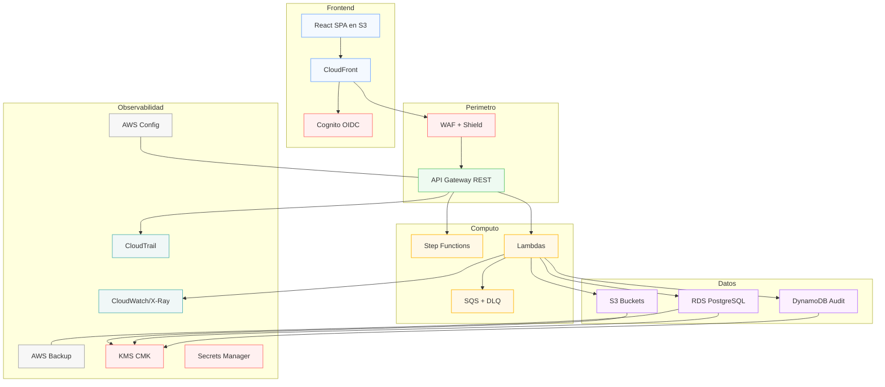

# 4) Despliegue Lógico por Capas - Vista de Contenedores

Arquitectura de despliegue organizada por capas funcionales.

```mermaid
flowchart TB
  subgraph Frontend
    SPA[React SPA en S3]:::fe
    CF[CloudFront]:::fe
    COG[Cognito OIDC]:::sec
  end
  subgraph Perimetro
    WAF[WAF + Shield]:::sec
    APIG[API Gateway REST]:::api
  end
  subgraph Computo
    SFN[Step Functions]:::comp
    LAMBDAS[Lambdas]:::comp
    SQS[SQS + DLQ]:::comp
  end
  subgraph Datos
    S3DOC[S3 Buckets]:::data
    RDS[RDS PostgreSQL]:::data
    DDB[DynamoDB Audit]:::data
  end
  subgraph Observabilidad
    CW[CloudWatch/X-Ray]:::obs
    CT[CloudTrail]:::obs
    CFG[AWS Config]:::gov
    BCK[AWS Backup]:::gov
    KMS[KMS CMK]:::sec
    SM[Secrets Manager]:::sec
  end

  SPA-->CF-->WAF-->APIG
  CF-->COG
  APIG-->SFN
  APIG-->LAMBDAS
  LAMBDAS-->SQS
  LAMBDAS-->S3DOC
  LAMBDAS-->RDS
  LAMBDAS-->DDB
  LAMBDAS-->CW
  APIG-->CT
  S3DOC-->KMS
  RDS-->KMS
  DDB-->KMS
  RDS---BCK
  CFG---APIG

  classDef fe fill:#f4f9ff,stroke:#6aa3ff,stroke-width:1.2
  classDef api fill:#eefaf1,stroke:#58c26a,stroke-width:1.2
  classDef comp fill:#fff8e6,stroke:#ffb200,stroke-width:1.2
  classDef data fill:#fcf0ff,stroke:#b26bff,stroke-width:1.2
  classDef obs fill:#f0f7f7,stroke:#4fb0ae,stroke-width:1.2
  classDef sec fill:#fff0f0,stroke:#ff6b6b,stroke-width:1.2
  classDef gov fill:#f7f7f7,stroke:#9e9e9e,stroke-width:1.2
``` 