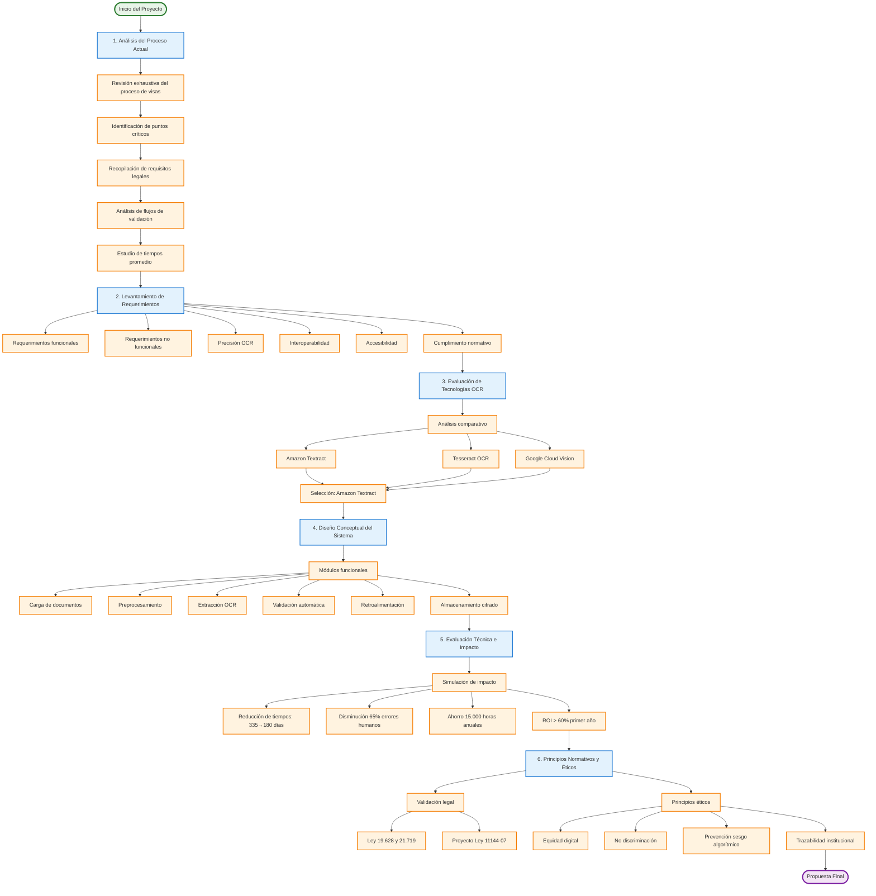

# 5) Metodología del Proyecto

Diagrama de flujo que ilustra las seis etapas de la metodología mixta: documental, descriptiva y propositiva.

```mermaid
flowchart TD
  START([Inicio del Proyecto]) --> A1[1. Análisis del Proceso Actual]
  
  A1 --> A1A[Revisión exhaustiva del proceso de visas]
  A1A --> A1B[Identificación de puntos críticos]
  A1B --> A1C[Recopilación de requisitos legales]
  A1C --> A1D[Análisis de flujos de validación]
  A1D --> A1E[Estudio de tiempos promedio]
  
  A1E --> A2[2. Levantamiento de Requerimientos]
  A2 --> A2A[Requerimientos funcionales]
  A2 --> A2B[Requerimientos no funcionales]
  A2 --> A2C[Precisión OCR]
  A2 --> A2D[Interoperabilidad]
  A2 --> A2E[Accesibilidad]
  A2 --> A2F[Cumplimiento normativo]
  
  A2F --> A3[3. Evaluación de Tecnologías OCR]
  A3 --> A3A[Análisis comparativo]
  A3A --> A3B[Amazon Textract]
  A3A --> A3C[Tesseract OCR]
  A3A --> A3D[Google Cloud Vision]
  A3B --> A3E[Selección: Amazon Textract]
  A3C --> A3E
  A3D --> A3E
  
  A3E --> A4[4. Diseño Conceptual del Sistema]
  A4 --> A4A[Módulos funcionales]
  A4A --> A4B[Carga de documentos]
  A4A --> A4C[Preprocesamiento]
  A4A --> A4D[Extracción OCR]
  A4A --> A4E[Validación automática]
  A4A --> A4F[Retroalimentación]
  A4A --> A4G[Almacenamiento cifrado]
  
  A4G --> A5[5. Evaluación Técnica e Impacto]
  A5 --> A5A[Simulación de impacto]
  A5A --> A5B[Reducción de tiempos: 335→180 días]
  A5A --> A5C[Disminución 65% errores humanos]
  A5A --> A5D[Ahorro 15.000 horas anuales]
  A5A --> A5E[ROI > 60% primer año]
  
  A5E --> A6[6. Principios Normativos y Éticos]
  A6 --> A6A[Validación legal]
  A6A --> A6B[Ley 19.628 y 21.719]
  A6A --> A6C[Proyecto Ley 11144-07]
  A6 --> A6D[Principios éticos]
  A6D --> A6E[Equidad digital]
  A6D --> A6F[No discriminación]
  A6D --> A6G[Prevención sesgo algorítmico]
  A6D --> A6H[Trazabilidad institucional]
  
  A6H --> END([Propuesta Final])
  
  %% Estilos para Word
  classDef start fill:#e8f5e8,stroke:#2e7d32,stroke-width:3px
  classDef stage fill:#e3f2fd,stroke:#1976d2,stroke-width:2px
  classDef sub fill:#fff3e0,stroke:#f57c00,stroke-width:2px
  classDef final fill:#f3e5f5,stroke:#7b1fa2,stroke-width:3px
  
  class START start
  class END final
  class A1,A2,A3,A4,A5,A6 stage
  class A1A,A1B,A1C,A1D,A1E,A2A,A2B,A2C,A2D,A2E,A2F,A3A,A3B,A3C,A3D,A3E,A4A,A4B,A4C,A4D,A4E,A4F,A4G,A5A,A5B,A5C,A5D,A5E,A6A,A6B,A6C,A6D,A6E,A6F,A6G,A6H sub
``` 