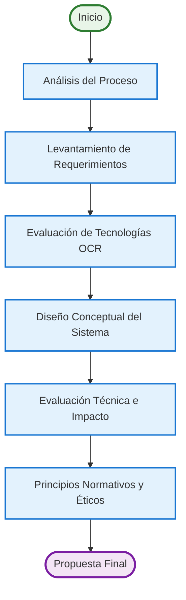

# 6) Metodología Simplificada

Diagrama simplificado de las 6 etapas de la metodología del proyecto.

```mermaid
flowchart TD
  START([Inicio]) --> A1[Análisis del Proceso]
  A1 --> A2[Levantamiento de Requerimientos]
  A2 --> A3[Evaluación de Tecnologías OCR]
  A3 --> A4[Diseño Conceptual del Sistema]
  A4 --> A5[Evaluación Técnica e Impacto]
  A5 --> A6[Principios Normativos y Éticos]
  A6 --> END([Propuesta Final])

  %% Estilos simplificados
  classDef start fill:#e8f5e8,stroke:#2e7d32,stroke-width:3px
  classDef stage fill:#e3f2fd,stroke:#1976d2,stroke-width:2px
  classDef final fill:#f3e5f5,stroke:#7b1fa2,stroke-width:3px

  class START start
  class A1,A2,A3,A4,A5,A6 stage
  class END final
``` 