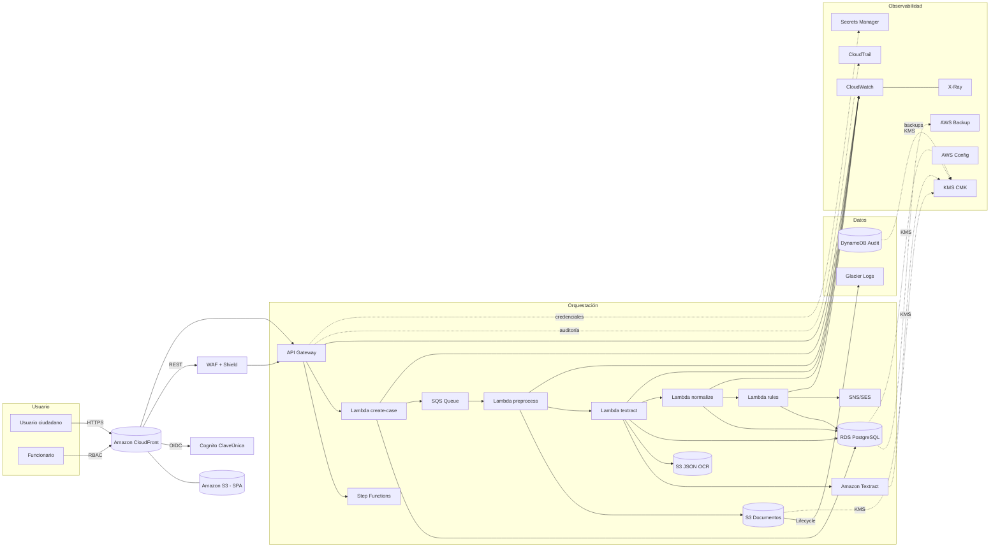
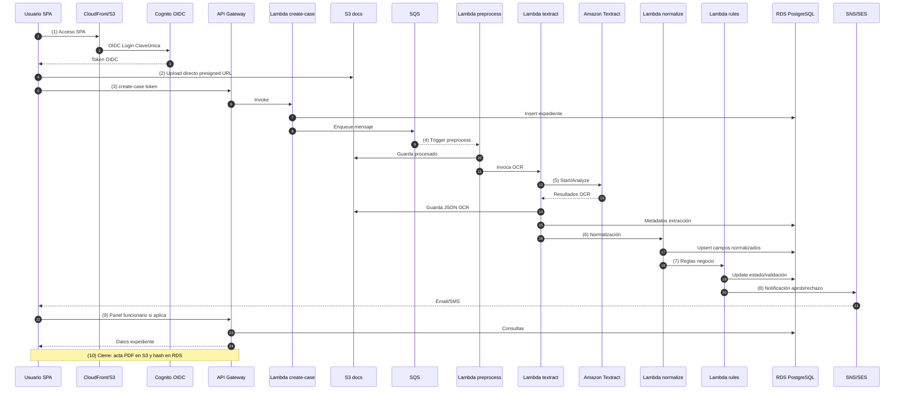
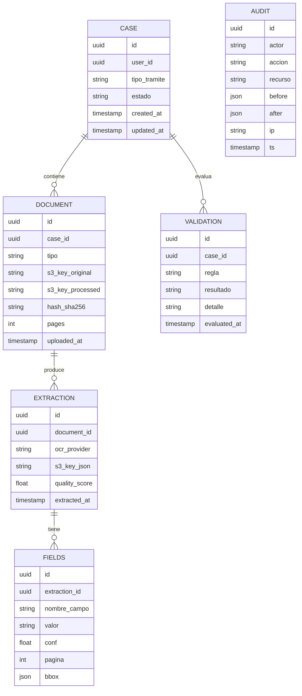
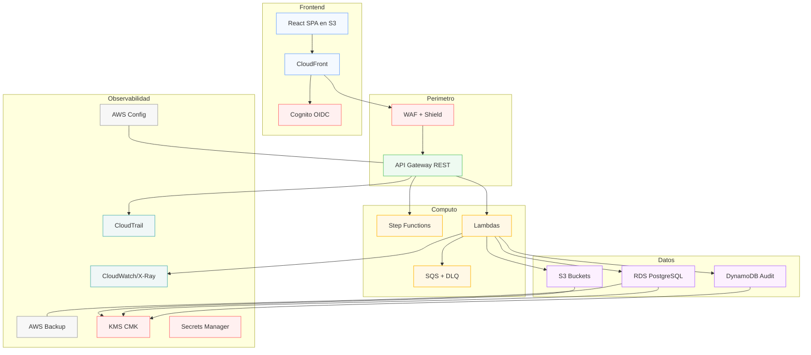

# Arquitectura Propuesta — Diagramas

> Sistema serverless en AWS con OCR, validación por reglas y cumplimiento normativo.

---

## 1) Vista general (alto nivel)

---

## 2) Flujo de datos (secuencia 7.2)

---

## 3) Modelo de datos mínimo viable (ER)

> Nota: Auditoría de alta frecuencia puede ir en DynamoDB (append-only) con TTL y export a S3 para archivado.

---

## 4) Despliegue lógico por capas (vista de contenedores)

---

## 5) Seguridad y cumplimiento (resumen operable)

- **Cifrado**: TLS 1.2+, S3/RDS/DDB/Textract con CMK administrada; SSE-KMS; políticas de bucket sin acceso público.
- **IAM**: Principio de mínimo privilegio por función Lambda; roles separados para lectura/escritura; condiciones por VPC/SourceArn en APIG.
- **PII**: Minimización, clasificación, etiquetas en S3; retención 18–24 meses; processings con Comprehend (opcional) para redacción.
- **Logs inmutables**: Export CloudTrail/CloudWatch a S3 con Object Lock + Glacier Vault Lock.
- **ARCO**: Endpoints dedicados (consulta/rectificación/oposición/cancelación) auditados; flujo de borrado lógico y físico por retención.
- **DR/Backups**: RPO ≤ 24h / RTO ≤ 8h; pruebas de restore trimestrales; runbooks en Systems Manager Documents.

---

## 6) Calidad y observabilidad

- **KPIs**: tasa extracción, % FAIL por regla, TTP (tiempo de trámite), retrabajos.
- **Alarmas**: `quality_score < umbral`, errores > N/min en una Lambda, DLQ con >0 mensajes, latencia APIG p95.
- **A/B**: variantes de preprocesamiento (deskew/denoise) sobre golden dataset para optimizar precisión OCR.

---

## 7) Costeo referencial (indicativo)

- **Textract**: 0.01–0.015 USD/página (según API).
- **S3**: almacenamiento originales, procesados, JSON OCR + lifecycle a Glacier.
- **Lambda/SQS/SFN**: pago por uso; revisar cargas pico y tamaños de payload.

---

### Notas

- Diagramas en Mermaid: pueden exportarse a PNG/SVG aquí o integrarse en Confluence/Markdown.
- Si se requiere, puedo generar una variante en formato C4 (Context/Container/Component) o PlantUML con íconos oficiales de AWS.

