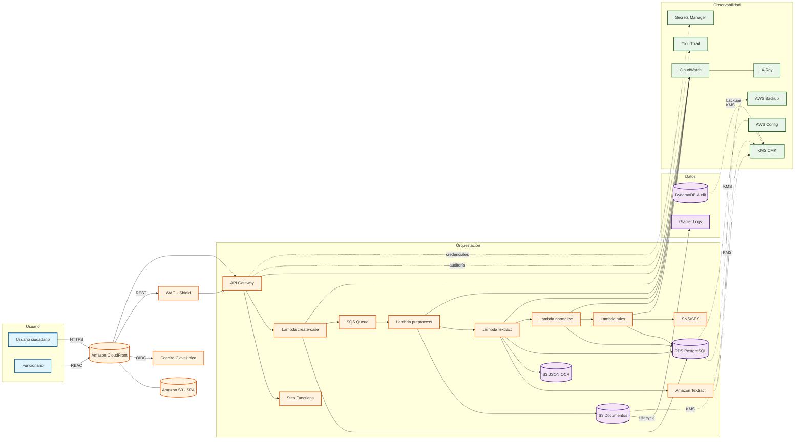

# 1) Vista General - Alto Nivel (Word)

Sistema serverless en AWS con OCR, validación por reglas y cumplimiento normativo.

```mermaid
flowchart LR
  subgraph Usuario
    U[Usuario ciudadano]
    F[Funcionario]
  end

  U -->|HTTPS| CF[(Amazon CloudFront)]
  CF --- S3FE[(Amazon S3 - SPA)]
  CF -->|OIDC| COG[Cognito ClaveÚnica]

  CF -->|REST| WAF[WAF + Shield]
  WAF --> APIG[API Gateway]

  subgraph Orquestación
    APIG --> SFN[Step Functions]
    APIG --> L0[Lambda create-case]
    L0 --> RDS[(RDS PostgreSQL)]
    L0 --> SQS[SQS Queue]
    SQS --> L1[Lambda preprocess]
    L1 --> S3DOC[(S3 Documentos)]
    L1 --> L2[Lambda textract]
    L2 --> TEX[Amazon Textract]
    L2 --> S3JSON[(S3 JSON OCR)]
    L2 --> RDS
    L2 --> L3[Lambda normalize]
    L3 --> RDS
    L3 --> L4[Lambda rules]
    L4 --> RDS
    L4 --> SNS[SNS/SES]
  end

  subgraph Datos
    DDB[(DynamoDB Audit)]
    GL[Glacier Logs]
    S3DOC -->|Lifecycle| GL
  end

  subgraph Observabilidad
    CW[CloudWatch]
    XR[X-Ray]
    CT[CloudTrail]
    KMS[KMS CMK]
    SM[Secrets Manager]
    CFG[AWS Config]
    BCK[AWS Backup]
  end

  APIG --> CW
  L0 --> CW
  L1 --> CW
  L2 --> CW
  L3 --> CW
  L4 --> CW
  CW --- XR
  APIG -.auditoría.-> CT
  RDS -.backups.-> BCK
  S3DOC -.KMS.-> KMS
  RDS -.KMS.-> KMS
  DDB -.KMS.-> KMS
  TEX -.KMS.-> KMS
  APIG -.credenciales.-> SM

  F -->|RBAC| CF
  CF --> APIG

  classDef default fill:#ffffff,stroke:#333333,stroke-width:2px
  classDef user fill:#e1f5fe,stroke:#01579b,stroke-width:2px
  classDef aws fill:#fff3e0,stroke:#e65100,stroke-width:2px
  classDef data fill:#f3e5f5,stroke:#4a148c,stroke-width:2px
  classDef obs fill:#e8f5e8,stroke:#1b5e20,stroke-width:2px

  class U,F user
  class CF,S3FE,COG,WAF,APIG,SFN,L0,L1,L2,L3,L4,SQS,SNS,TEX aws
  class RDS,S3DOC,S3JSON,DDB,GL data
  class CW,XR,CT,KMS,SM,CFG,BCK obs
``` 