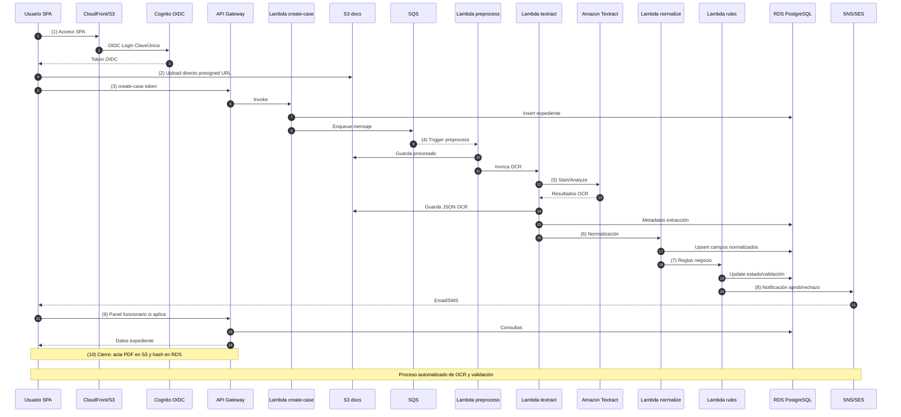

# 2) Flujo de Datos - Secuencia (Word)

Flujo detallado del proceso de tramitación con OCR y validación por reglas.

```mermaid
sequenceDiagram
  autonumber
  participant User as Usuario SPA
  participant CF as CloudFront/S3
  participant COG as Cognito OIDC
  participant APIG as API Gateway
  participant L0 as Lambda create-case
  participant S3 as S3 docs
  participant SQS as SQS
  participant L1 as Lambda preprocess
  participant L2 as Lambda textract
  participant TEX as Amazon Textract
  participant L3 as Lambda normalize
  participant L4 as Lambda rules
  participant RDS as RDS PostgreSQL
  participant SNS as SNS/SES

  User->>CF: (1) Acceso SPA
  CF->>COG: OIDC Login ClaveÚnica
  COG-->>User: Token OIDC
  User->>S3: (2) Upload directo presigned URL
  User->>APIG: (3) create-case token
  APIG->>L0: Invoke
  L0->>RDS: Insert expediente
  L0->>SQS: Enqueue mensaje
  SQS-->>L1: (4) Trigger preprocess
  L1->>S3: Guarda procesado
  L1->>L2: Invoca OCR
  L2->>TEX: (5) Start/Analyze
  TEX-->>L2: Resultados OCR
  L2->>S3: Guarda JSON OCR
  L2->>RDS: Metadatos extracción
  L2->>L3: (6) Normalización
  L3->>RDS: Upsert campos normalizados
  L3->>L4: (7) Reglas negocio
  L4->>RDS: Update estado/validación
  L4->>SNS: (8) Notificación aprob/rechazo
  SNS-->>User: Email/SMS
  User->>APIG: (9) Panel funcionario si aplica
  APIG->>RDS: Consultas
  APIG-->>User: Datos expediente
  Note over User,APIG: (10) Cierre: acta PDF en S3 y hash en RDS

  rect rgb(255, 255, 255)
    Note over User,SNS: Proceso automatizado de OCR y validación
  end
``` 