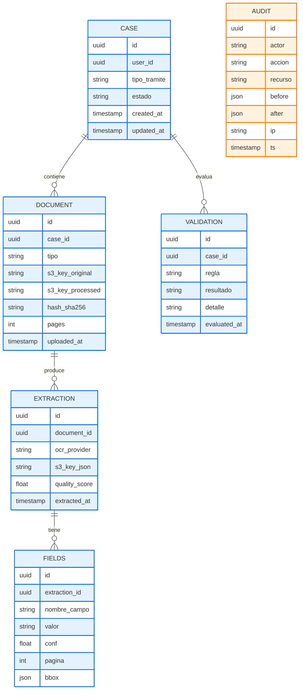

# 3) Modelo de Datos - ER (Word)

Modelo entidad-relación para el sistema de visación de residencia.

```mermaid
erDiagram
  CASE ||--o{ DOCUMENT : contiene
  DOCUMENT ||--o{ EXTRACTION : produce
  EXTRACTION ||--o{ FIELDS : tiene
  CASE ||--o{ VALIDATION : evalua

  AUDIT {
    uuid id
    string actor
    string accion
    string recurso
    json before
    json after
    string ip
    timestamp ts
  }

  CASE {
    uuid id
    uuid user_id
    string tipo_tramite
    string estado
    timestamp created_at
    timestamp updated_at
  }

  DOCUMENT {
    uuid id
    uuid case_id
    string tipo
    string s3_key_original
    string s3_key_processed
    string hash_sha256
    int pages
    timestamp uploaded_at
  }

  EXTRACTION {
    uuid id
    uuid document_id
    string ocr_provider
    string s3_key_json
    float quality_score
    timestamp extracted_at
  }

  FIELDS {
    uuid id
    uuid extraction_id
    string nombre_campo
    string valor
    float conf
    int pagina
    json bbox
  }

  VALIDATION {
    uuid id
    uuid case_id
    string regla
    string resultado
    string detalle
    timestamp evaluated_at
  }

  %% Estilos para Word
  classDef default fill:#ffffff,stroke:#333333,stroke-width:2px
  classDef entity fill:#e3f2fd,stroke:#1976d2,stroke-width:2px
  classDef audit fill:#fff3e0,stroke:#f57c00,stroke-width:2px

  class CASE,DOCUMENT,EXTRACTION,FIELDS,VALIDATION entity
  class AUDIT audit
``` 