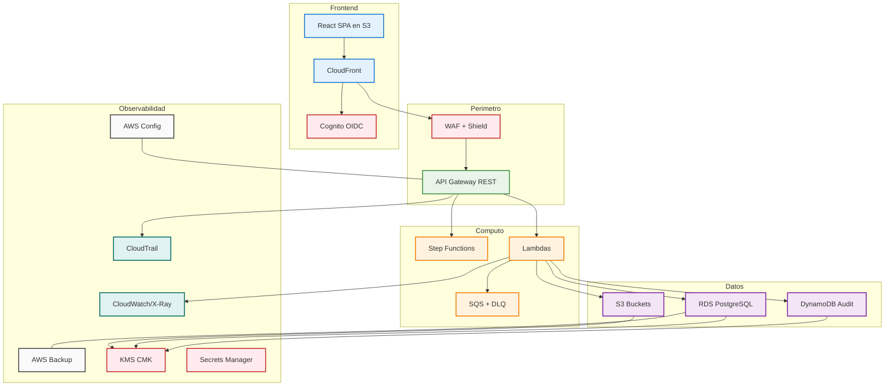

# 4) Despliegue Lógico por Capas (Word)

Arquitectura de despliegue organizada por capas funcionales.

```mermaid
flowchart TB
  subgraph Frontend
    SPA[React SPA en S3]:::fe
    CF[CloudFront]:::fe
    COG[Cognito OIDC]:::sec
  end
  subgraph Perimetro
    WAF[WAF + Shield]:::sec
    APIG[API Gateway REST]:::api
  end
  subgraph Computo
    SFN[Step Functions]:::comp
    LAMBDAS[Lambdas]:::comp
    SQS[SQS + DLQ]:::comp
  end
  subgraph Datos
    S3DOC[S3 Buckets]:::data
    RDS[RDS PostgreSQL]:::data
    DDB[DynamoDB Audit]:::data
  end
  subgraph Observabilidad
    CW[CloudWatch/X-Ray]:::obs
    CT[CloudTrail]:::obs
    CFG[AWS Config]:::gov
    BCK[AWS Backup]:::gov
    KMS[KMS CMK]:::sec
    SM[Secrets Manager]:::sec
  end

  SPA-->CF-->WAF-->APIG
  CF-->COG
  APIG-->SFN
  APIG-->LAMBDAS
  LAMBDAS-->SQS
  LAMBDAS-->S3DOC
  LAMBDAS-->RDS
  LAMBDAS-->DDB
  LAMBDAS-->CW
  APIG-->CT
  S3DOC-->KMS
  RDS-->KMS
  DDB-->KMS
  RDS---BCK
  CFG---APIG

  %% Estilos optimizados para Word
  classDef fe fill:#e3f2fd,stroke:#1976d2,stroke-width:2px
  classDef api fill:#e8f5e8,stroke:#388e3c,stroke-width:2px
  classDef comp fill:#fff3e0,stroke:#f57c00,stroke-width:2px
  classDef data fill:#f3e5f5,stroke:#7b1fa2,stroke-width:2px
  classDef obs fill:#e0f2f1,stroke:#00695c,stroke-width:2px
  classDef sec fill:#ffebee,stroke:#c62828,stroke-width:2px
  classDef gov fill:#fafafa,stroke:#424242,stroke-width:2px
``` 