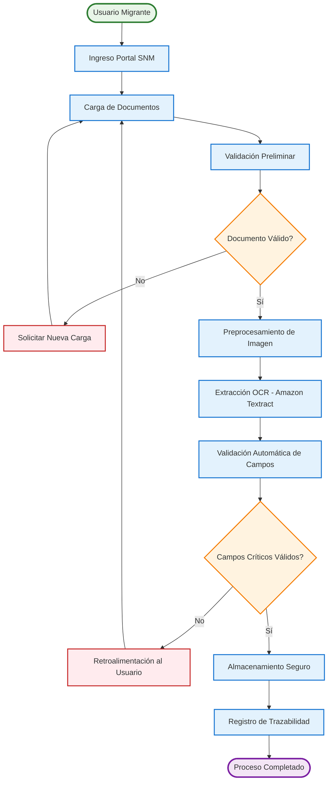

# 7) Flujo Técnico del Sistema (Word)

Diagrama del flujo técnico propuesto para la automatización de validación de documentos migratorios.

```mermaid
flowchart TD
  START([Usuario Migrante]) --> A1[Ingreso Portal SNM]
  A1 --> A2[Carga de Documentos]
  A2 --> A3[Validación Preliminar]
  
  A3 --> A3A{Documento Válido?}
  A3A -->|No| A3B[Solicitar Nueva Carga]
  A3B --> A2
  A3A -->|Sí| A4[Preprocesamiento de Imagen]
  
  A4 --> A5[Extracción OCR - Amazon Textract]
  A5 --> A6[Validación Automática de Campos]
  
  A6 --> A6A{Campos Críticos Válidos?}
  A6A -->|No| A6B[Retroalimentación al Usuario]
  A6B --> A2
  A6A -->|Sí| A7[Almacenamiento Seguro]
  
  A7 --> A8[Registro de Trazabilidad]
  A8 --> END([Proceso Completado])

  %% Estilos optimizados para Word
  classDef start fill:#e8f5e8,stroke:#2e7d32,stroke-width:3px
  classDef stage fill:#e3f2fd,stroke:#1976d2,stroke-width:2px
  classDef decision fill:#fff3e0,stroke:#f57c00,stroke-width:2px
  classDef error fill:#ffebee,stroke:#c62828,stroke-width:2px
  classDef final fill:#f3e5f5,stroke:#7b1fa2,stroke-width:3px

  class START start
  class A1,A2,A3,A4,A5,A6,A7,A8 stage
  class A3A,A6A decision
  class A3B,A6B error
  class END final
``` 